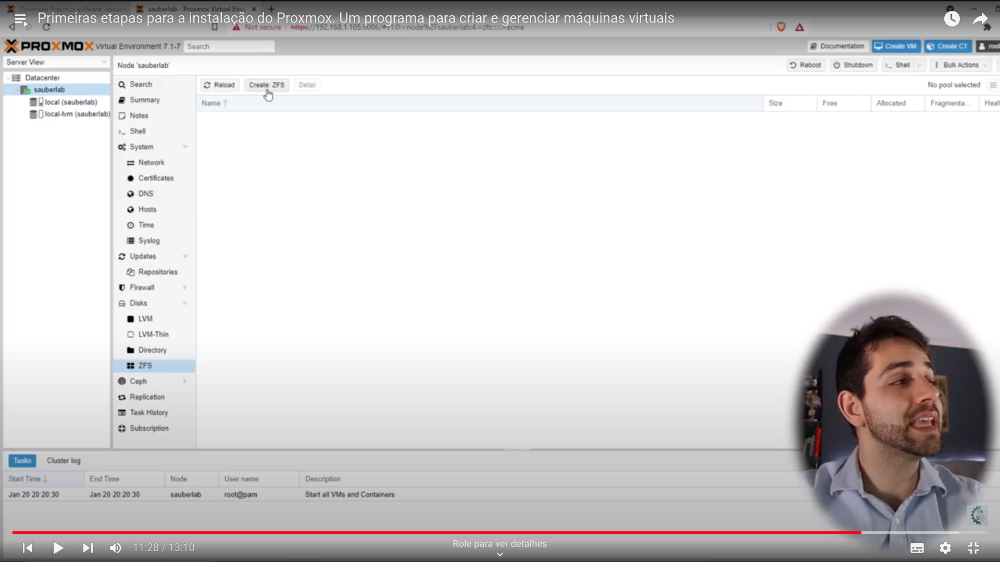
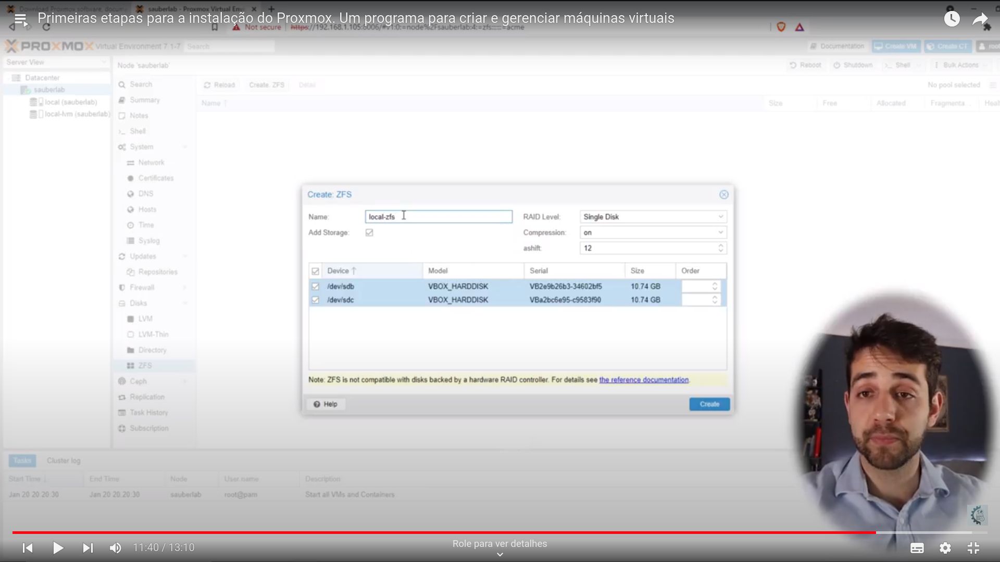
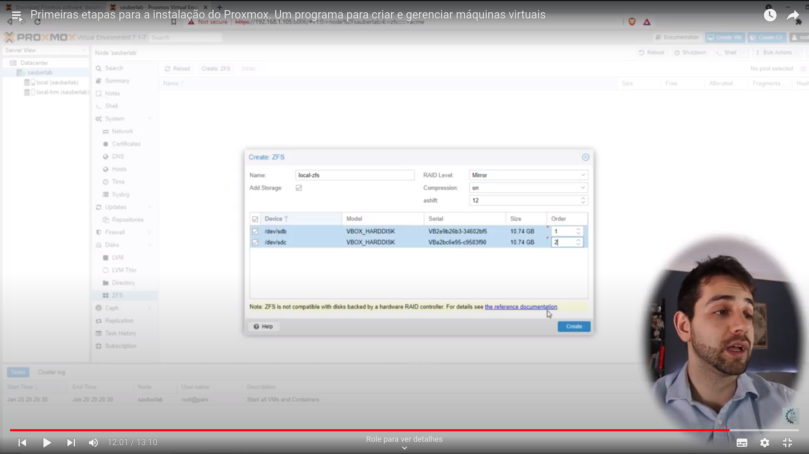

# Adição de storage

Pode se criar storages LVM e ZFS. O curso foca no ZFS, como pode ser visto na imagem.

## Logo após, definir as partições que farão parte do storage

## Também pode se defnir a ordem de prioridade das partições

