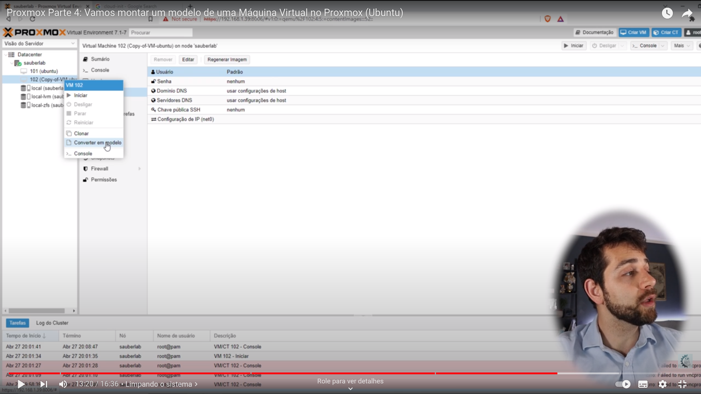

# Criar Template

1- Criar um clone de VM. Detalhe: Após criar, desligue o original antes de ligar o clone.

2- Acesse e instale todos os pacotes e dependências necessárias

3- Remove o id da máquina:

```bash
truncate -s 0 /etc/machine-id
```

4- Remover as chaves criadas de SSH

```bash
cd /etc/ssh
rm ssh_host_*
```

5- Limpar cache do apt

```bash
apt clean
aot autoremove
```

6-Desligar a VM

7- Converter em modelo


