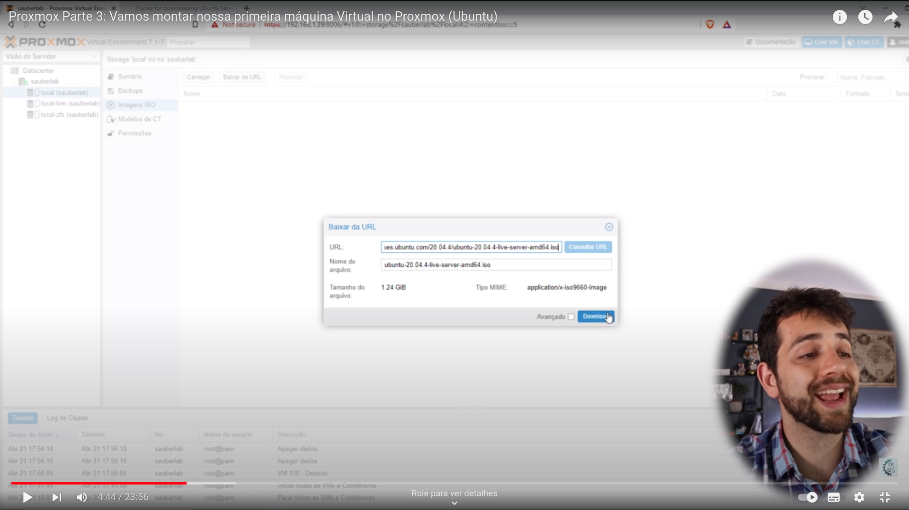
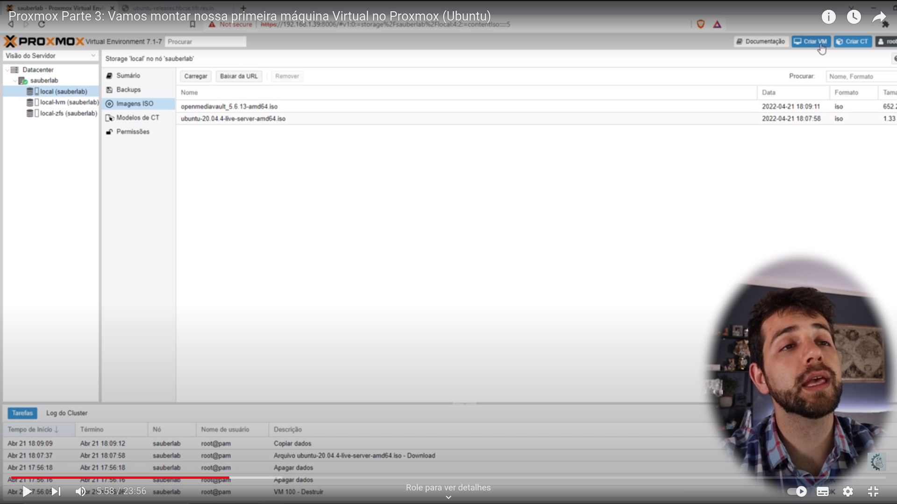
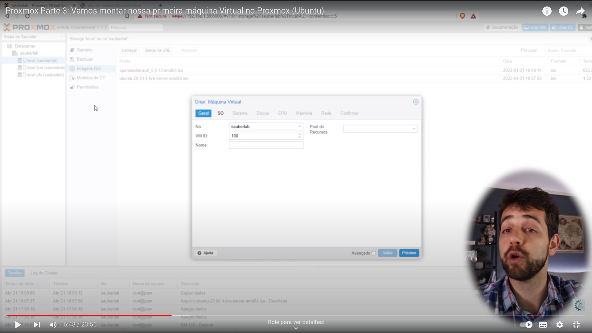
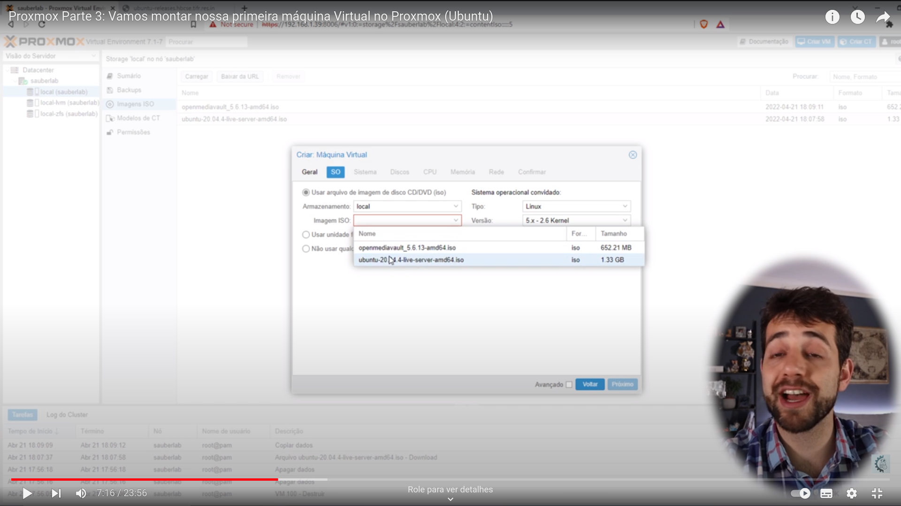
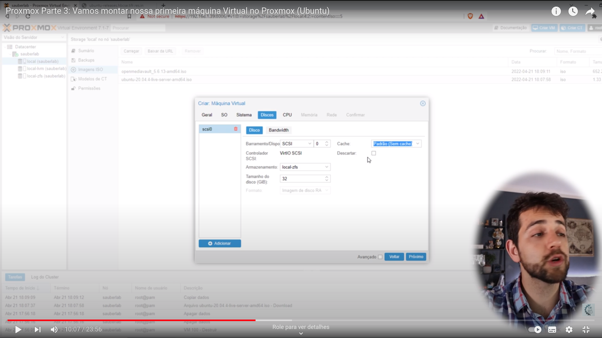
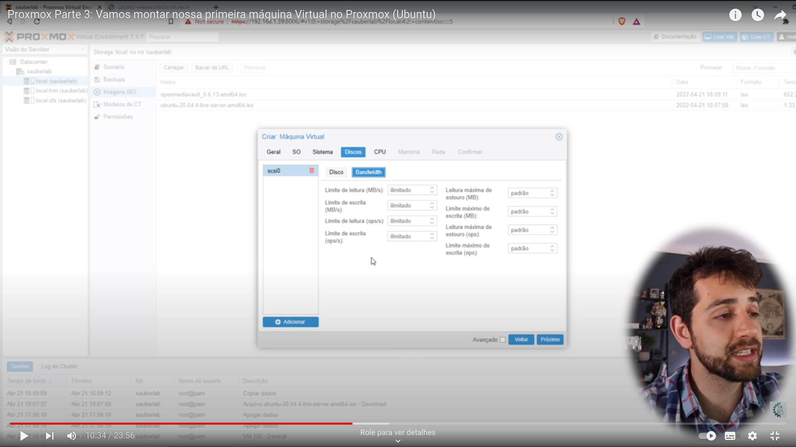
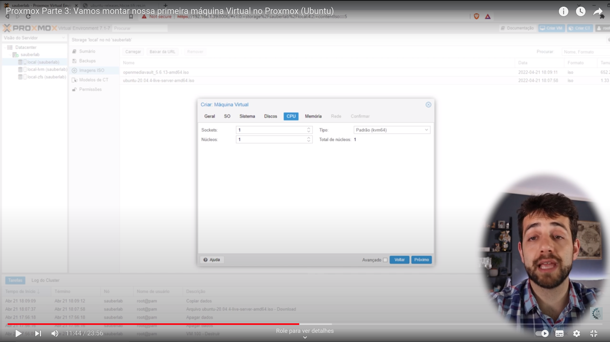
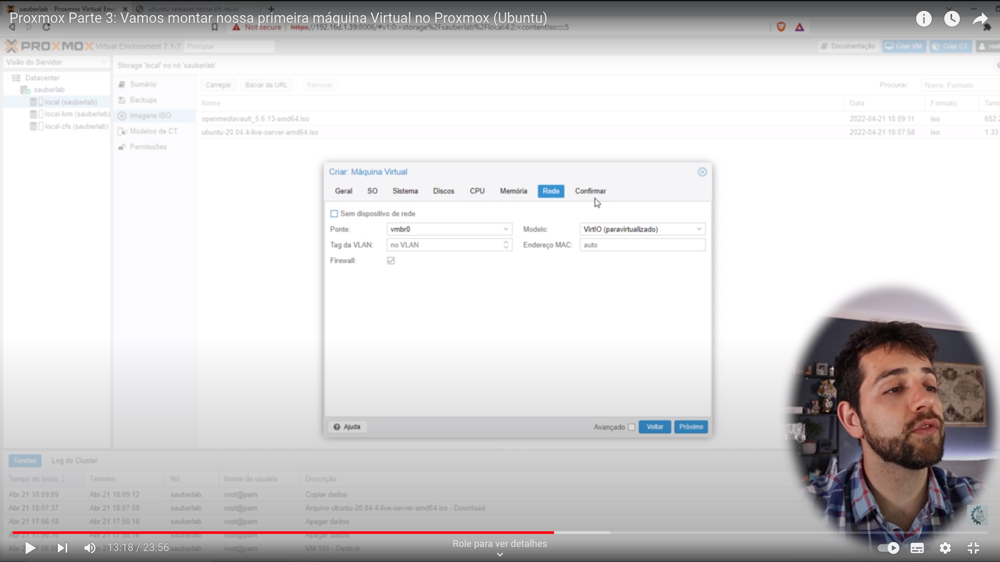
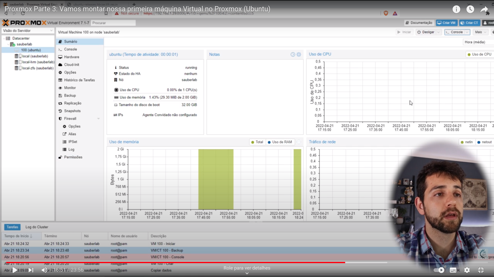

# Criando VM

Podemos baixar de uma iso url da internet

## Ao clicar no canto superior direito para criar uma VM, a seguinte caixa aparece com uma serie de parâmetros a serem preenchidos

É importante definir um VM ID único para cada VM. O nó vai estar padrão.

## Na tela seguinte é escolhido o SO

## Na tela seguinte, pode ser definido a placa de vídeo, ou mantê-la padrão.

## A definição de armazenamento é feita na próxima tela. Pode se escolher o storage, bem como o tamanho do disco disponível para o SO.

## Próxima tela define a velocidade de leitura/escrita. Deixar padrão. No entanto, pode ser alterado para melhorar a performance com aumento do número de VMs.

## Próxima tela definimos a quantidade de CPUS da VM

## Por fim, definimos a rede. Deixar padrão.

## Após o fim do processo, a máquina ira aparecer no datacenter, com seu id de identificação.

